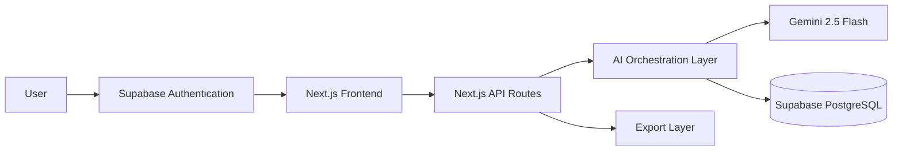

# System Architecture

## High-Level Architecture

## Component Responsibilities

### Authentication Layer

Supabase Authentication manages:

- User registration and login
- Session management
- User identity verification
- Secure access to user-specific projects and feedback history

The application uses authentication to ensure each PM can access only their own workspace data.

### Frontend

- Dashboard
- Feedback Input
- Results Visualization
- Export Actions

Technology

- Next.js 15
- TypeScript
- Tailwind CSS
- shadcn/ui

---

### Backend

Responsible for:

- API endpoints
- AI orchestration
- Prompt construction
- Database communication
- Export generation

---

### AI Layer

Gemini performs:

- Feedback summarization
- Semantic clustering
- Theme extraction
- Priority detection
- Engineering specification generation

---

### Database

Supabase stores:

- User profiles linked with authentication
- Feedback submissions
- AI analysis results
- Generated specifications
- Project/workspace history

| Component | Purpose |
|-----------|---------|
| Supabase Auth | Provides secure user authentication and simplifies SaaS user management |

---

## Architecture Decisions

| Decision | Reason |
|-----------|--------|
| Next.js Full Stack | Single deployment, simpler architecture |
| API Routes | No separate backend required |
| Gemini Flash | Fast inference for hackathon demo |
| Supabase | Managed PostgreSQL with minimal setup |
| Vercel | Instant deployment and CI integration |

## Security Considerations

- Authentication handled through Supabase Auth.
- User data is isolated through authenticated database access.
- API keys are stored using environment variables.
- Input validation prevents malformed AI requests.
- AI-generated outputs are validated before storage.
