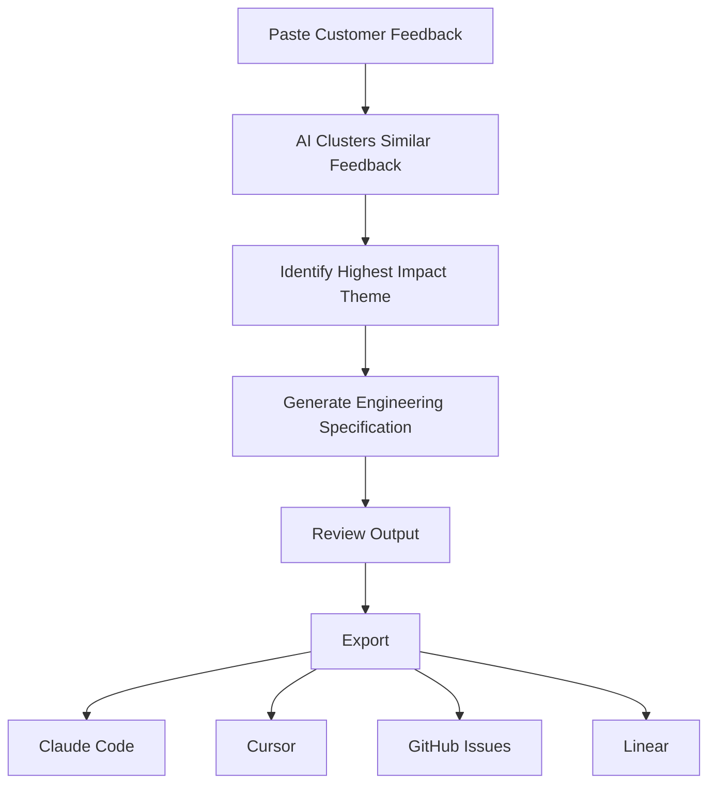

# User Flow

## Primary Workflow

---

## User Journey

### Step 1

Paste customer feedback into the dashboard.

↓

### Step 2

AI analyzes and groups similar issues.

↓

### Step 3

Most impactful customer problem is identified.

↓

### Step 4

AI generates:

- Problem Statement
- Acceptance Criteria
- Technical Tasks
- Edge Cases
- Implementation Notes

↓

### Step 5

Export specification into the preferred developer workflow.

---

## Design Decisions

- Minimal user input
- Single-click workflow
- AI handles complexity
- Developer-ready output